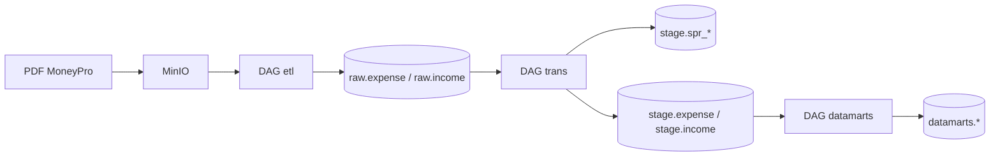

# dailypay

Локальное хранилище личных финансов: PDF-отчёт MoneyPro из MinIO разбирается Airflow, складывается в Postgres и собирается dbt в слои `raw` → `stage` → `datamarts`.

Стек поднимается одним Docker Compose. Оркестрация — Apache Airflow 2.10, трансформации — dbt-postgres. ML/BI-слоёв в репозитории пока нет.

## Архитектура



| Слой | Схема | Что хранит |
|---|---|---|
| Сырьё | `raw` | Строки из PDF как есть: дата, контрагент, категория, конверт, сумма, файл, время загрузки |
| Справочники | `stage` | `spr_payee`, `spr_category`, `spr_envelope` — имя и суррогатный id |
| Факты | `stage` | `expense` / `income` — те же операции, но уже с id справочников |
| Витрины | `datamarts` | Агрегаты по дням и месяцам (VIEW) |

База DWH — `finance_dwh` (имя задаётся в `.env` как `POSTGRES_DB`). Метаданные Airflow живут в отдельной БД `AIRFLOW_DB` на том же Postgres.

## Стек

| Сервис | Образ / контейнер | Зачем |
|---|---|---|
| MinIO | `dailypay_minio` | S3-совместимое хранилище PDF |
| Postgres 16 | `dailypay_postgres` | DWH и БД Airflow |
| Airflow 2.10.0 | `dailypay_airflow_webserver`, `dailypay_airflow_scheduler` | DAG `etl`, `trans`, `datamarts` |
| dbt | `dailypay_dbt` | `dbt run` / `dbt test` без оркестрации |

Данные переживают перезапуск контейнеров: тома `pg_data`, `minio_data`, `airflow_logs`. Код примонтирован с диска: `./airflow`, `./dbt`, `./data`.

Порты задаются в `.env`. Обычно UI Airflow — [http://localhost:8080](http://localhost:8080), консоль MinIO — порт `MINIO_CONSOLE_PORT`, API MinIO — `MINIO_API_PORT`, Postgres с хоста — `POSTGRES_PORT`.

## Структура репозитория

```
.
├── airflow/
│   ├── dags/             etl.py, trans.py, marts.py
│   ├── engines/          клиент MinIO
│   ├── scripts/          разбор PDF и загрузка в Postgres
│   └── requirements.txt  minio, pdfplumber, pangres, dbt-postgres
├── dbt/
│   ├── models/staging/   spr_* и stg_*
│   ├── models/datamarts/ витрины
│   ├── macros/           схема без префикса public_
│   ├── packages.yml      dbt_utils, dbt_expectations
│   └── profiles.yml      target docker, хост postgres
├── data/                 DDL схем и таблиц для PostgresOperator
├── postgres/             init: создать БД Airflow
├── .github/workflows/    CI
├── docker-compose.yml
└── makefile
```

## Пайплайн

Все три DAG с `schedule=None` — запускаются вручную из UI или CLI, в таком порядке.

### 1. `etl` (`airflow/dags/el.py`)

1. `extract_all` — список объектов в бакете MinIO.
2. `extract_one` — самый свежий PDF. Пустой бакет → `AirflowFailException`.
3. `create_schemes` — `data/schemes.sql`: схемы `raw`, `stage`, `datamarts`.
4. `create_tables` — `data/raw_scheme.sql`: `raw.expense`, `raw.income`.
5. Параллельно `load_expense` (`kind=расход`) и `load_income` (`kind=доход`).

PDF читается `pdfplumber` (`airflow/scripts/pdfextract.py`), в Postgres пишет `pangres` (`airflow/scripts/postgresextract.py`).

PK сырья: `(txn_date, category, envelope, amount)`.

### 2. `trans` (`airflow/dags/trans.py`)

1. DDL стейджа — `data/stage_scheme.sql`.
2. PK справочников — `data/stage_keys.sql`.
3. `dbt deps`, если ещё нет `dbt_packages`.
4. Справочники: `spr_category`, `spr_envelope`, `spr_payee`.
5. Факты: `stg_expense` → таблица `stage.expense`, `stg_income` → `stage.income` (`alias` в модели).

dbt в Airflow смотрит в `/opt/dbt` (`DBT_PROFILES_DIR`). В контейнере `dailypay_dbt` тот же проект смонтирован в `/usr/app`.

В образе Airflow нет `git`. Если пакеты уже лежат в `dbt/dbt_packages`, задача `dbt_deps` их не качает.

### 3. `datamarts` (`airflow/dags/marts.py`)

Один `dbt run --select expence_day expence_month income_month`.

Имена моделей с опечаткой `expence` — так файлы и называются, в `--select` нужно писать так же.

## Модели dbt

Проект `dbt/`, профиль `dailypay`, target `docker`. Кастомный `generate_schema_name` пишет в схемы `stage` и `datamarts` без префикса `public_`.

Пакеты: `dbt-labs/dbt_utils` 1.4.1, `metaplane/dbt_expectations` 0.10.10. Для expectations в `dbt_project.yml` задана таймзона `Europe/Moscow`.

### Справочники (`incremental`, `delete+insert`, перед вставкой `truncate`)

- Берутся имена из `raw.expense` и `raw.income`.
- Отсекаются `NULL`, строки с запятой (`not like '%,%'`).
- Категория ещё фильтруется `~ '^[А-ЯA-Z]'`.
- В справочник попадает имя, которое встретилось **больше одного раза** (`having count(*) > 1`).
- `id` = `row_number() over (order by имя)`.

Поэтому разовые контрагенты и категории вида `питания, Продукты питания` в справочник не попадают. В фактах у таких строк id будет `NULL` — это следствие фильтров, не сломанный джойн по «осиротевшему» ключу.

### Факты

Категория в джойне: `split_part(category, ', ', 1)`. Дальше `LEFT JOIN` на `spr_*` по имени. `unique_key` факта включает id; из‑за смены `row_number()` модели тоже делают `truncate` перед загрузкой, иначе в таблицах остаются старые id.

### Витрины (VIEW, несмотря на `+materialized: table` в `dbt_project.yml`)

| Модель | Зерно | Источник |
|---|---|---|
| `expence_day` | день | `stg_expense` |
| `expence_month` | год + месяц | `stg_expense` |
| `income_month` | год + месяц | `stg_income` |

Тесты: `not_null` / `unique`, `dbt_utils.expression_is_true` (`amount > 0`), `dbt_expectations.expect_column_values_to_be_between`, `relationships` фактов на справочники.

## Запуск

Нужны Docker и файл `.env` в корне (в git не коммитится). Ориентир по переменным из `docker-compose.yml`:

```
POSTGRES_USER
POSTGRES_PASSWORD
POSTGRES_DB
POSTGRES_PORT
AIRFLOW_DB
AIRFLOW_ADMIN_USERNAME
AIRFLOW_ADMIN_PASSWORD
AIRFLOW_ADMIN_FIRSTNAME
AIRFLOW_ADMIN_LASTNAME
AIRFLOW_ADMIN_EMAIL
AIRFLOW__WEBSERVER__SECRET_KEY
AIRFLOW_WEBSERVER_PORT
MINIO_ROOT_USER
MINIO_ROOT_PASSWORD
MINIO_BUCKET
MINIO_API_PORT
MINIO_CONSOLE_PORT
```

Первый подъём:

```bash
make up
```

Эквивалент: `docker compose up -d`.

После старта Airflow webserver заново ставит пакеты из `_PIP_ADDITIONAL_REQUIREMENTS` (~1 минута). Пока gunicorn не слушает 8080, UI не откроется:

```bash
make health    # ожидайте 200
make ps
```

1. В консоли MinIO загрузить PDF MoneyPro в бакет `MINIO_BUCKET`.
2. UI Airflow: логин из `AIRFLOW_ADMIN_*`.
3. Trigger по очереди: **etl** → дождаться success → **trans** → **datamarts**.

Новый DAG может появиться на паузе (в UI фильтр All, не только Active):

```bash
docker exec dailypay_airflow_scheduler airflow dags unpause datamarts
```

dbt без Airflow:

```bash
make dbt-run
make dbt-test
```

Это `docker exec dailypay_dbt dbt run` / `dbt test`. Контейнер уже знает `WORKDIR=/usr/app` и `DBT_PROFILES_DIR`.

## Makefile

Команды из корня репозитория. В рецептах — символ Tab, не пробелы.

| Цель | Действие |
|---|---|
| `make up` | `docker compose up -d` |
| `make down` | остановить контейнеры, **тома не удаляет** |
| `make restart` | только webserver и scheduler |
| `make restart-all` | все сервисы compose |
| `make ps` | статус |
| `make health` | HTTP-код `/health` на 8080 |
| `make dbt-run` / `make dbt-test` | dbt в контейнере `dailypay_dbt` |
| `make push MSG="..."` | `git add .` → commit → `git push origin main` |

Данные **не** пропадают при `restart` / `down` / `up`. Их сотрёт только `docker compose down -v` (этой цели в Makefile нет).

После `make restart` снова подождите, пока `make health` вернёт `200`. Если UI «не открывается», чаще всего gunicorn ещё поднимается или воркер перезапустился по таймауту.

## CI

`.github/workflows/ci.yml` — на `push` и `pull_request`:

1. `python3 -m py_compile airflow/dags/*.py`
2. `pip install dbt-postgres==1.10.2`
3. `dbt deps --project-dir dbt --profiles-dir dbt`

В CI нет Postgres и нет `dbt run`. Для `profiles.yml` на раннере нужны фиктивные `POSTGRES_USER` / `PASSWORD` / `DB`, если job начнёт читать профиль; сейчас `deps` ставит пакеты из `packages.yml`.

## Полезные адреса и клиенты

- Airflow: `http://localhost:${AIRFLOW_WEBSERVER_PORT}`
- MinIO Console: `http://localhost:${MINIO_CONSOLE_PORT}`
- Postgres с хоста: `localhost:${POSTGRES_PORT}`, база `POSTGRES_DB`, пользователь `POSTGRES_USER`

Из соседнего контейнера хост Postgres — `postgres:5432` (так в `dbt/profiles.yml`).
